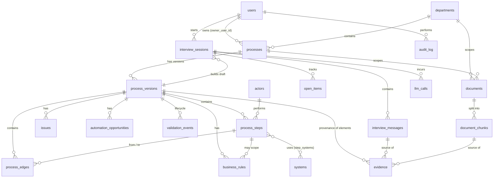

# Process AI — Build Plan (Draft for Approval)

Date: 2026-10-03
Status: Approved 2026-10-03 — see `docs/decisions/2026-10-03-process-ai-foundation.md` for the approved decisions, which override anything below where they differ.

---

## 0. Environment & Skills Inventory

### What is installed locally

| Tool | Status | Notes |
|---|---|---|
| Node.js | v22.19.0 | Good (LTS). |
| npm | 10.9.3 | Present. |
| pnpm | Missing | Enable via `corepack enable` (ships with Node, nothing to download from a new source). |
| Docker | 29.6.1 installed, **daemon not running** | Needed for local Postgres + pgvector. Start Docker Desktop. |
| PostgreSQL | `psql` 18.4 client only (libpq) | No local server and no pgvector. Use the `pgvector/pgvector:pg17` Docker image instead of a Homebrew server. |
| git | 2.54 | Project folder is **not yet a git repo**. |
| gh, az CLI, M365 Agents Toolkit CLI | Missing | `az` needed at deployment (Phase 6); Agents Toolkit only at Teams phase (Phase 7). Don't install yet. |
| Python 3.13 | Present | Not needed for the app. |

### Claude Code capabilities found, and whether to use them

**Recommend using**

| Capability | Type | Use for |
|---|---|---|
| `superpowers:writing-plans`, `executing-plans`, `subagent-driven-development` | Skills (plugin) | Turning each phase into task lists and executing them with checkpoints. |
| `superpowers:test-driven-development` | Skill | Interview engine, gap analysis, op validator, lifecycle rules — deterministic logic that should be test-first. |
| `superpowers:systematic-debugging`, `verification-before-completion` | Skills | Debugging; "prove it works" before marking phases done. |
| `superpowers:requesting-code-review` + `superpowers:code-reviewer` agent, built-in `/code-review`, `/simplify` | Skills/agents | End-of-phase review. |
| `security-audit` skill, `security-reviewer` agent, built-in `/security-review` | Skills/agents | Phase 6 hardening; review of auth, upload, RAG code. |
| `ui-ux-pro-max` | Skill (plugin) | Enterprise dashboard/admin UI patterns; has shadcn/ui integration. |
| `impeccable` | Skill | UI critique/polish passes (hierarchy, empty states, accessibility). |
| `react-best-practices` | Skill | React performance review (some content is Next.js-specific; ignore those parts). |
| `anthropic-skills:docx` / `xlsx` / `pdf` | Skills | Generating **realistic test fixtures** (fake Procurement SOP, DoA matrix in XLSX, checklist PDF) for ingestion and agent tests. |
| `planner`, `general-reviewer` | Project agents | Phase planning and plan/doc review. |
| **Microsoft Learn MCP** (claude.ai connector) | MCP — **needs authorization** | Authoritative, current docs for Teams SDK, Entra ID, Graph, Azure. Strongly recommended before Phases 6–7. Authorize it in claude.ai connector settings; it can't be authorized from this session. |

**Not relevant — don't use for this project**

Remotion skills, mediabunny, brandkit, img2threejs, image-generation skills, and the marketing/landing-page "taste" skills (`gpt-taste`, `high-end-visual-design`, `brutalist`, `soft-skill` etc.) — these target marketing sites and would push the UI away from a calm enterprise tool. Shopify, Figma, Canva, Gamma, HubSpot connectors — not needed. `claude-api` skill — only relevant if Anthropic models are chosen as a provider.

**Optional install (ask first):** Context7 MCP (version-correct library docs for Drizzle, React Flow, Fastify). Useful but not essential.

**Nothing has been installed.** Proposed setup before Phase 0: start Docker, `corepack enable`, `git init`, authorize Microsoft Learn MCP.

---

## 1. Recommended Architecture

```
                    ┌────────────────────────┐      ┌────────────────────────┐
                    │  Web App (React SPA)   │      │ Microsoft Teams (Ph 7) │
                    │  Library · Chat · Admin│      │  1:1 chat, Adaptive    │
                    │  MSAL (Entra ID SSO)   │      │  Cards, SSO            │
                    └───────────┬────────────┘      └───────────┬────────────┘
                     HTTPS/JSON │ + SSE stream                  │ Bot activity (Azure Bot Service)
                                │                               │
┌───────────────────────────────▼───────────────────────────────▼──────────────────┐
│ API (Node + Fastify) — single deployable                                         │
│                                                                                  │
│  Channel adapters:   [Web REST/SSE adapter]        [Teams adapter (Teams SDK)]   │
│                              │                               │                   │
│                              └──────────┬────────────────────┘                   │
│                                         ▼                                        │
│  Application services: Auth/RBAC · Processes · Versions · Documents · Admin     │
│                         · Interview service · Audit                              │
│                                         │                                        │
│  ┌──────────────────────────────────────▼──────────────────────────────────┐    │
│  │ packages/agent — Interview Engine (channel-agnostic, no HTTP, no Teams)  │    │
│  │  Context builder → Fact extractor (LLM) → Op validator (code)            │    │
│  │  → State applier (code) → Gap analyser (code) → Question policy (code)   │    │
│  │  → Response writer (LLM)          Retrieval (hybrid RAG)                 │    │
│  │  Improvement analyser (heuristics + LLM)                                 │    │
│  └───────────────┬──────────────────────────────────────┬───────────────────┘    │
│                  │                                      │                        │
│     LLM Gateway (Vercel AI SDK: OpenAI / Azure OpenAI)  │   Job queue (pg-boss)  │
│                                                         │   doc ingestion,       │
│                                                         │   analysis jobs        │
└──────────────────┬──────────────────────────────────────┼────────────────────────┘
                   │                                      │
      ┌────────────▼─────────────┐          ┌─────────────▼─────────────┐
      │ PostgreSQL 17 + pgvector │          │ File storage              │
      │ source of truth: process │          │ local disk (dev) /        │
      │ model, sessions, state,  │          │ Azure Blob (prod)         │
      │ chunks+embeddings, audit │          └───────────────────────────┘
      └──────────────────────────┘
```

Key points:

- **One backend deployable** (API + background worker in the same process for the pilot, separable later). The built SPA is served by the API in production → one container.
- **The interview engine is a library** (`packages/agent`), called by the interview service. Channels never talk to the engine directly; they call the same service methods (`startSession`, `postMessage`, `confirmSummary`).
- **PostgreSQL holds everything**: relational process model, interview state, documents' chunks + vectors, job queue, audit. No Redis, no separate vector DB.
- **LLM output is never stored as the process.** The LLM proposes typed operations; deterministic code validates and applies them.

---

## 2. Technology Decisions

| Area | Choice | Why |
|---|---|---|
| Monorepo | **pnpm workspaces** (no Turborepo/Nx yet) | Shared types between web, API, agent with almost no tooling overhead. Add Turborepo only if builds get slow. |
| React setup | **Vite + React + TypeScript**, React Router, TanStack Query | Internal, authenticated app: no SEO or SSR need. Next.js would add a second server layer next to Fastify and complicate Teams-tab hosting and MSAL. Vite is simpler and faster. |
| Components | **shadcn/ui (Radix + Tailwind)** — *alternative: Fluent UI v9* | Mature, accessible primitives; full control of code; strong table/form/dialog patterns; `ui-ux-pro-max` supports it. Choose Fluent UI v9 instead if matching the Teams/M365 look is a priority (decision for you). |
| Forms / validation | react-hook-form + zod | zod schemas shared with the API. |
| Node framework | **Fastify** | Clean plugin/module structure, first-class TypeScript, schema validation with zod type provider, built-in pino logging, fast. NestJS adds DI/decorator ceremony we don't need; Express has weaker typing/validation story. |
| Database | **PostgreSQL 17** (Docker `pgvector/pgvector:pg17` locally; Azure Database for PostgreSQL Flexible Server in prod) | Mandatory; Flexible Server supports the `vector` extension. |
| ORM / migrations | **Drizzle ORM + drizzle-kit** | SQL-first, excellent type inference, native pgvector column + distance helpers, typed JSONB, plain SQL migration files reviewable in PRs, no engine binary. Prisma needs raw SQL for pgvector; TypeORM's decorator model and typing are weaker. |
| Vector search | **pgvector (HNSW) + Postgres full-text (tsvector), hybrid via reciprocal-rank fusion** | Pilot volume is small (hundreds of docs, ≪100k chunks). Hybrid matters because procurement docs are full of exact terms (AED thresholds, form numbers, "DoA"). Azure AI Search only if we later need OCR-at-scale, SharePoint-synced security trimming, or millions of chunks. |
| Search (library) | Postgres FTS + `pg_trgm` | Process name/description/step search without extra infra. |
| Authentication | **Microsoft Entra ID**: MSAL React (auth code + PKCE) in SPA; API validates JWT access tokens via JWKS (`jose`). **Dev mode**: `AUTH_MODE=dev` with seeded user picker; refuses to start when `NODE_ENV=production`. | Enterprise SSO; no passwords. |
| Authorization | App-level roles in DB (`user`, `admin`) + per-process **owner** relationship | See §8 and approval item #4. |
| Process visualisation | **React Flow (`@xyflow/react`) + ELK.js auto-layout** | Custom node types (task, decision diamond, approval, start/end), click-to-inspect, zoom/minimap, handles branches and loops; layout computed from data, never hand-drawn. bpmn-js forces BPMN XML as the model, is heavier and harder to customise. BPMN XML **export** can be added later from our model. |
| File storage | `StorageProvider` interface: local disk (dev), Azure Blob (prod) | Keeps binaries out of Postgres; easy swap. |
| Document parsing | PDF: `unpdf` (pdf.js); DOCX: `mammoth`; XLSX: SheetJS (from cdn.sheetjs.com, not the stale npm package) or `exceljs`; TXT: native. File type sniffing: `file-type`. | Mature libraries. No OCR in MVP (scanned PDFs flagged as "no text extracted"). |
| Background jobs | **pg-boss** (Postgres-backed queue) | Async ingestion/analysis without Redis. |
| LLM integration | **Vercel AI SDK (`ai`)** with `@ai-sdk/azure` and `@ai-sdk/openai`, wrapped in our own thin `LlmGateway` (per-task model config: `extract`, `respond`, `summarise`, `analyse`, `embed`) | Mature provider abstraction, zod-typed structured output, streaming. Swapping OpenAI ↔ Azure OpenAI (or other providers) is a config change. Recommend **Azure OpenAI** for the pilot (tenant data residency/contract). |
| Embeddings | `text-embedding-3-small` (1536 dims) via same gateway | Cheap, good quality; dimension stored in config/migration. |
| Streaming | Server-Sent Events from Fastify | Simple, works through proxies; no WebSockets needed. |
| Teams | **Microsoft Teams SDK (Teams AI Library v2, JS)** + Azure Bot resource with **single-tenant Entra app identity** (or user-assigned managed identity), Microsoft 365 Agents Toolkit for manifest/sideload | Bot Framework SDK reached end of support Dec 2025; Microsoft recommends Teams SDK for Teams-only apps and M365 Agents SDK for multi-channel/Copilot agents. Our own architecture already provides multi-channel, so Teams SDK is the lighter fit. Revisit Agents SDK if M365 Copilot surfacing becomes a goal. |
| Logging | pino (Fastify built-in), request IDs, `llm_calls` table for model usage/cost/latency | Proportionate observability; OpenTelemetry later. |
| Testing | **Vitest** (unit + integration), **Testcontainers** (real Postgres+pgvector in integration tests), **Playwright** (a handful of E2E smoke flows), **agent evaluation set** (scripted transcripts + recorded/mock LLM responses for CI; manual eval run against the real model) | Deterministic logic tested hard; LLM behaviour evaluated separately. |
| Deployment | Docker image → **Azure Container Apps**; Azure Database for PostgreSQL Flexible Server; Azure Blob; Azure Key Vault; Azure OpenAI. GitHub Actions or Azure DevOps (whichever your org uses). | Minimal managed footprint in Microsoft's cloud, which Teams/Entra already require. |

---

## 3. Data Model

### Modelling principles

1. **Process ≠ Process Version.** A `process` is the stable identity (name, department, owner). All content — metadata, steps, edges, rules — belongs to a `process_version`. Validated versions are immutable; changes create a new draft version.
2. **Graph, not list.** Steps are nodes; `process_edges` are typed connections (`sequence`, `branch`, `exception`, `alternate`, `loop_back`) with optional condition labels. Decisions are nodes with ≥2 labelled outgoing edges.
3. **Provenance on every fact.** Every process element carries a `provenance` status (`stated`, `documented`, `inferred`, `confirmed`, `disputed`) and links to `evidence` rows pointing at the message or document chunk it came from and who provided it.
4. **Interview state is relational.** Open questions, gaps, ambiguities, contradictions and assumptions are rows in `open_items`, not text in a prompt.
5. **JSONB only where it earns it**: message metadata (citations, token usage), audit before/after snapshots, step "extra attributes", Teams conversation references.
6. **Recommendations are separate tables** (`issues`, `automation_opportunities`) and never modify steps.

### ERD



### Proposed PostgreSQL schema (core)

Shown as condensed SQL; will be implemented as Drizzle schema + generated migrations. All tables have `id uuid pk default gen_random_uuid()`; `created_at/updated_at timestamptz` omitted for brevity.

```sql
-- Identity & org
create table users (
  entra_oid text unique,                 -- null for dev users
  email citext unique not null,
  display_name text not null,
  department_text text,                  -- from Graph, informational
  roles text[] not null default '{user}',-- 'user' | 'admin'  (see approvals)
  is_active boolean default true,
  last_login_at timestamptz
);
create table departments (
  name text not null, slug text unique not null, description text,
  is_active boolean default true
);

-- Catalogues (org-wide reference data, deduped by normalised name)
create table actors  (name text, kind text check (kind in ('role','team','external')),
                      department_id uuid references departments, normalized_name text unique);
create table systems (name text, description text, normalized_name text unique);

-- Process identity & versions
create type version_status as enum ('draft','under_validation','validated','approved','archived');
create type version_kind   as enum ('as_is','to_be');
create table processes (
  department_id uuid not null references departments,
  name text not null, slug text not null,
  owner_user_id uuid references users,
  current_version_id uuid,               -- latest validated version (fk added after versions)
  created_by uuid references users,
  archived_at timestamptz,
  unique (department_id, slug)
);
create table process_versions (
  process_id uuid not null references processes on delete cascade,
  version_number int not null,
  kind version_kind not null default 'as_is',
  status version_status not null default 'draft',
  based_on_version_id uuid references process_versions,
  description text, purpose text, trigger text, end_condition text,
  frequency text, volume text, scope_notes text,
  completeness_score numeric(5,2),       -- computed by gap analyser
  change_summary text,
  created_by uuid references users,
  submitted_at timestamptz, validated_by uuid references users, validated_at timestamptz,
  search_tsv tsvector generated always as (...) stored,
  unique (process_id, kind, version_number)
);

-- Process graph
create type provenance as enum ('stated','documented','inferred','confirmed','disputed');
create type step_type  as enum ('start','task','decision','approval','end','subprocess');
create table process_steps (
  version_id uuid not null references process_versions on delete cascade,
  step_key text not null,                -- stable across versions, e.g. 'S4'
  sequence int,                          -- display/order hint only, NOT the flow
  type step_type not null default 'task',
  name text not null, description text,
  actor_id uuid references actors,
  inputs text[] default '{}', outputs text[] default '{}',
  execution text check (execution in ('manual','automated','semi_automated','unknown')) default 'unknown',
  expected_duration text, sla text,
  approval_authority text,               -- for type='approval' (e.g. 'CFO above AED 500k')
  pain_points text[] default '{}',       -- raw user wording; structured issues live in issues
  attributes jsonb default '{}',         -- genuinely flexible extras
  provenance provenance not null default 'stated',
  confidence numeric(3,2),
  unique (version_id, step_key)
);
create table step_systems (step_id uuid references process_steps on delete cascade,
                           system_id uuid references systems, primary key (step_id, system_id));
create type edge_type as enum ('sequence','branch','exception','alternate','loop_back');
create table process_edges (
  version_id uuid not null references process_versions on delete cascade,
  from_step_id uuid not null references process_steps on delete cascade,
  to_step_id   uuid not null references process_steps on delete cascade,
  type edge_type not null default 'sequence',
  condition_label text,                  -- 'Amount > AED 50k', 'Rejected', 'Vendor already exists'
  provenance provenance not null default 'stated',
  unique (version_id, from_step_id, to_step_id, type)
);
create table business_rules (
  version_id uuid not null references process_versions on delete cascade,
  step_id uuid references process_steps on delete cascade,  -- null = process-level
  rule_type text check (rule_type in ('threshold','approval','compliance','sla','control','other')),
  statement text not null,
  provenance provenance not null default 'stated'
);
create table step_dependencies (step_id uuid references process_steps on delete cascade,
                                depends_on_step_id uuid references process_steps on delete cascade,
                                primary key (step_id, depends_on_step_id));

-- Provenance / evidence (polymorphic by design: one place to answer "where did this come from?")
create table evidence (
  version_id uuid not null references process_versions on delete cascade,
  entity_type text not null,             -- 'process_version'|'step'|'edge'|'rule'|'issue'|...
  entity_id uuid not null,
  field text,                            -- e.g. 'sla' (null = whole entity)
  source_type text not null check (source_type in ('user_statement','document','ai_inference','user_validation','manual_edit')),
  message_id uuid references interview_messages,
  chunk_id uuid references document_chunks,
  quote text,                            -- verbatim snippet supporting the fact
  provided_by uuid references users
);
create index on evidence (entity_type, entity_id);

-- Interview
create type session_stage as enum ('scoping','happy_path','step_detail','branches_exceptions',
                                   'rules_controls_pain','summary','completed');
create table interview_sessions (
  user_id uuid not null references users,
  process_id uuid references processes,
  version_id uuid references process_versions,   -- the draft being built
  channel text not null default 'web',           -- 'web' | 'teams'
  stage session_stage not null default 'scoping',
  status text not null default 'active' check (status in ('active','paused','completed','abandoned')),
  focus_step_id uuid references process_steps,   -- where the conversation currently is
  running_summary text,                          -- rolling compressed history
  summarized_through_message_id uuid,
  last_activity_at timestamptz
);
create table interview_messages (
  session_id uuid not null references interview_sessions on delete cascade,
  role text not null check (role in ('user','assistant','system')),
  content text not null,
  author_user_id uuid references users,
  channel text not null default 'web',
  metadata jsonb default '{}'          -- citations, open_item ids asked, token usage
);
create type open_item_type as enum ('missing_info','question','ambiguity','contradiction','assumption');
create table open_items (
  session_id uuid not null references interview_sessions on delete cascade,
  version_id uuid not null references process_versions on delete cascade,
  type open_item_type not null,
  entity_type text, entity_id uuid, field text,  -- what it is about
  description text not null,
  sop_chunk_id uuid references document_chunks, -- for contradictions
  priority int not null default 50,
  status text not null default 'open' check (status in ('open','asked','resolved','dismissed')),
  asked_in_message_id uuid, resolved_by_message_id uuid, resolution text
);

-- Improvement analysis (kept separate from current-state facts)
create table issues (
  version_id uuid not null references process_versions on delete cascade,
  step_id uuid references process_steps on delete set null,
  category text not null,  -- manual_work|duplicate_entry|unnecessary_approval|rework|handoff_delay|
                           -- unclear_ownership|missing_sla|control_gap|other
  title text not null, description text, severity text check (severity in ('low','medium','high')),
  source text not null check (source in ('user','ai_heuristic','ai_llm')),
  status text not null default 'proposed' check (status in ('proposed','accepted','dismissed')),
  decided_by uuid references users
);
create table automation_opportunities (
  version_id uuid not null references process_versions on delete cascade,
  step_id uuid references process_steps on delete set null,
  kind text check (kind in ('workflow','integration','rpa','ai','self_service','other')),
  title text not null, description text, expected_benefit text,
  effort text check (effort in ('low','medium','high')),
  source text not null, status text not null default 'proposed',
  decided_by uuid references users
);

-- Validation & lifecycle history
create table validation_events (
  version_id uuid not null references process_versions on delete cascade,
  action text not null check (action in ('summary_confirmed','correction','submitted',
                                         'validated','returned','archived','reopened')),
  actor_user_id uuid not null references users,
  comment text
);

-- Knowledge base: admin creates a knowledge base ("container", e.g. "Procurement"),
-- then uploads categorised documents into it; ingestion vectorises them.
create table knowledge_bases (
  name text not null, slug text unique not null, description text,
  department_id uuid references departments,   -- e.g. Procurement KB → Procurement dept
  is_active boolean default true,
  created_by uuid references users
);
create table documents (
  knowledge_base_id uuid not null references knowledge_bases,
  title text not null, filename text not null, mime_type text not null,
  size_bytes bigint, sha256 text not null, storage_key text not null,
  process_id uuid references processes,          -- optional link to a specific process
  category text not null check (category in ('sop','policy','doa','approval_matrix','form','checklist','other')),
  doc_version text, effective_date date,
  supersedes_document_id uuid references documents,
  is_active boolean default true,
  ingestion_status text default 'pending' check (ingestion_status in ('pending','processing','ready','failed')),
  ingestion_error text,
  uploaded_by uuid not null references users
);
create table document_chunks (
  document_id uuid not null references documents on delete cascade,
  chunk_index int not null,
  content text not null,
  heading_path text,                     -- 'Section 4 > 4.2 Vendor Registration'
  page int, sheet text,
  token_count int,
  embedding vector(1536),
  tsv tsvector generated always as (to_tsvector('english', content)) stored
);
create index on document_chunks using hnsw (embedding vector_cosine_ops);
create index on document_chunks using gin (tsv);

-- Ops
create table audit_log (
  actor_user_id uuid references users, action text not null,
  entity_type text not null, entity_id uuid,
  before jsonb, after jsonb, request_id text
);
create table llm_calls (
  session_id uuid references interview_sessions, purpose text not null,
  provider text, model text, input_tokens int, output_tokens int,
  latency_ms int, status text, error text
);
-- Phase 7
create table channel_conversations (
  user_id uuid references users, channel text, conversation_ref jsonb,
  active_session_id uuid references interview_sessions
);
```

Notes:
- **Versioning**: "Edit" on a validated version clones it (steps keep `step_key`) into a new draft. Diffs between versions compare by `step_key`.
- **Process status shown in the UI** = status of the version being viewed; the library shows `current_version_id` (latest validated) or the draft if none exists.
- **To-Be** is supported by the `kind` column but not built in MVP.

---

## 4. Agent Architecture

### 4.1 Interview turn pipeline (per user message)

```
user message
   │
   ▼
1. Persist message (interview_messages)
2. Build context  (code)   → compact process outline + open items + running summary
                             + last ~8 messages + focus step
3. Retrieve       (code)   → hybrid search over permitted SOP chunks (query = message + focus)
4. Extract        (LLM)    → structured "ops" (zod schema), each with provenance + quote
5. Validate ops   (code)   → schema, referential integrity, provenance rules, citation check
6. Apply          (code)   → one transaction: upsert steps/edges/rules/actors/systems,
                             write evidence rows, resolve/create open_items, audit
7. Gap analysis   (code)   → completeness rules → missing_info items + score
8. Stage policy   (code)   → advance stage when coverage thresholds met
9. Select next    (code)   → pick 1–2 open items to ask (priority + conversational continuity)
10. Respond       (LLM, streamed) → natural reply: brief acknowledgement + the chosen question(s)
                             (+ SOP citation when raising a contradiction)
11. Persist reply, mark items 'asked', log llm_calls
```

Two LLM calls per turn, by design: extraction needs deterministic, non-streamed structured output; the reply should stream. The engine decides *what* to ask; the LLM only decides *how to phrase it*.

### 4.2 Extraction ops (the LLM's only write path)

A closed set of typed operations, e.g.:

`set_process_field`, `add_step`, `update_step`, `add_edge`, `add_actor_to_step`, `add_system_to_step`, `add_business_rule`, `add_exception_path`, `record_pain_point`, `resolve_open_item`, `raise_ambiguity`, `raise_contradiction(chunk_id, sop_claim, user_claim)`, `record_assumption`.

Each op carries `provenance` (`stated` if the user said it; `inferred` if the model deduced it) and a `quote` from the user's message. The validator rejects: references to non-existent steps, citations to chunk IDs that weren't in the retrieved context, `stated` provenance without a supporting quote, and any attempt to set status/ownership/permissions (not in the op set at all).

### 4.3 Interview state

Everything is in Postgres: the draft `process_version` + its graph = *collected information*; `open_items` = *unresolved questions, missing attributes, ambiguities, contradictions, assumptions*; `evidence` = *retrieved evidence and provenance*; `interview_sessions.stage/focus_step_id/running_summary` = *conversation position*. Sessions can be paused and resumed from any channel; on resume the engine generates a short recap from state, not from history.

### 4.4 Stages and question policy (deterministic)

| Stage | Goal | Exit condition |
|---|---|---|
| scoping | name, purpose, trigger, end condition, owner, scope boundaries | required metadata present |
| happy_path | walk the main path start→end ("what happens next?") | path from trigger to an end node exists |
| step_detail | actor, system, inputs/outputs, duration/SLA per step | ≥80% of steps have actor + system |
| branches_exceptions | decisions, approvals, rejections, rework, exceptions | every decision has ≥2 labelled exits; approvals have authority |
| rules_controls_pain | thresholds, controls, pain points | asked at least once per major step |
| summary | present summary; confirm / correct / add | user confirms |

Next-question priority: (1) contradiction with SOP on something just discussed; (2) gaps on the current focus step (keeps the conversation natural); (3) "what happens next" to extend the graph; (4) outstanding scoping fields; (5) exceptions/SLA/pain for earlier steps. Max **two questions per message**, enforced by the engine passing at most two items to the writer. The user can always redirect ("let's talk about exceptions") — the extractor detects topic shifts and the engine moves the focus.

### 4.5 Context reconstruction (bounded prompt size)

Each call gets: system instructions for that task (small, task-specific — not one giant prompt), a **compact process outline** rendered from the DB (step keys, names, actors, edges, ~1–3k tokens), open items (top ~10), the running summary, the last ~8 messages, and ≤5 retrieved chunks. The running summary is refreshed every ~10 messages by a summarisation call. Prompt size stays roughly constant (~8–12k tokens) whether the interview is 10 or 200 messages long.

### 4.6 RAG

- **Ingestion** (pg-boss job): sniff type → extract text → structure-aware chunking (headings for DOCX/PDF; for XLSX each row serialised with its column headers, so a DoA row becomes "Category: Goods | Amount: > AED 500,000 | Approver: CFO") → embed → store. Status visible in admin.
- **Retrieval**: hybrid vector + FTS, fused by reciprocal rank, filtered by `is_active`, scope (global + Procurement + this process), and the caller's permissions.
- **Citations**: chunks are passed with IDs; replies cite document title + section; the validator ensures cited IDs were actually retrieved.
- **Documents are data, not instructions** (see §8).

### 4.7 SOP comparison — three layers of truth

Every element is visibly one of: **Documented** (from SOP), **Stated** (employee said it), **Inferred** (AI deduction, dashed outline in the map), **Confirmed** (user validated), **Disputed** (open contradiction). Contradictions become `open_items` of type `contradiction` and are asked explicitly, e.g. *"The Procurement Policy (§4.2) says Finance approval is only required above AED 100,000, but you described Finance reviewing every request. Which reflects current practice?"* The answer is recorded as-is ("actual practice differs from SOP") — that gap itself is a valuable finding and becomes an `issue` (control gap / policy deviation) candidate.

### 4.8 Validation & completion

- **Completeness score** (code) from weighted rules: required metadata, every step has actor, graph is connected, all nodes reach an end, decisions have labelled exits, approvals have authority, no high-priority open items.
- Summary is triggered when score ≥ threshold *or* the user says they're done (the engine then lists what's still missing and lets them stop anyway — incomplete processes are allowed, but flagged).
- **Summary** = deterministic structured outline from DB + a short LLM narrative. User can **Confirm**, **Correct** (free text → goes back through extraction), or **Add**. Confirmation turns provenance `stated/inferred` → `confirmed` only for items the user saw, logs `validation_events`, and moves the version to `under_validation` for the process owner.

### 4.9 Improvement analysis (separate, on demand / after summary)

- **Heuristics (code)**: steps with no SLA, no owner, same data entered in multiple systems, ≥N handoffs between actors, approval chains > N, loops (rework), manual steps between two systems.
- **LLM analysis**: given the confirmed model, propose issues and automation/AI opportunities with rationale referencing step keys.
- Output stored as `proposed` in `issues` / `automation_opportunities`; owners accept or dismiss. **Never modifies the As-Is model.**

---

## 5. API Design

REST + JSON, zod-validated, all under `/api/v1`. Errors use RFC 9457 problem-details.

| Domain | Endpoints |
|---|---|
| Auth | `GET /me` · `GET /auth/dev-users`, `POST /auth/dev-login` (dev only) |
| Users (admin) | `GET /users` · `PATCH /users/:id` (roles, active) |
| Departments | `GET /departments` · `POST /departments` · `PATCH /departments/:id` (admin) |
| Processes | `GET /processes?department=&q=&status=` · `POST /processes` · `GET /processes/:id` · `PATCH /processes/:id` (name, owner) · `POST /processes/:id/archive` |
| Versions | `GET /processes/:id/versions` · `GET /versions/:id` (full graph: metadata, steps, edges, rules, actors, systems, provenance) · `POST /processes/:id/versions` (new draft from latest) · `PATCH /versions/:id` (metadata) |
| Steps & edges | `POST/PATCH/DELETE /versions/:id/steps[/:stepId]` · `POST/DELETE /versions/:id/edges[/:edgeId]` (form-based edits by owners) |
| Interview | `POST /interviews` (start; optional processId) · `GET /interviews?mine=1` · `GET /interviews/:id` (state + open items) · `GET /interviews/:id/messages` · `POST /interviews/:id/messages` (→ SSE stream of reply + state-changed events) · `POST /interviews/:id/pause` · `POST /interviews/:id/summary` · `POST /interviews/:id/confirm` |
| Validation | `POST /versions/:id/submit` · `POST /versions/:id/validate` · `POST /versions/:id/return` · `GET /versions/:id/history` |
| Evidence | `GET /versions/:id/evidence?entityId=` |
| Issues & opportunities | `GET /versions/:id/issues` · `GET /versions/:id/opportunities` · `POST /versions/:id/analyse` · `PATCH /issues/:id` · `PATCH /opportunities/:id` (accept/dismiss) |
| Documents | `POST /documents` (multipart) · `GET /documents?scope=&departmentId=&processId=` · `GET /documents/:id` · `GET /documents/:id/download` · `PATCH /documents/:id` · `DELETE /documents/:id` (soft) · `POST /documents/:id/reindex` · `POST /knowledge/search` (admin test tool) |
| Process packs (added 2026-10-03) | `GET /versions/:id/pack.pdf` (process pack) · `GET /versions/:id/map.svg` (map only) · `GET /departments/:slug/pack.zip` (bulk: PDF + SVG per visible process, plus `index.csv`) |
| Admin | `GET /admin/sessions` · `GET /admin/drafts` · `GET /admin/audit` |
| Teams (Ph 7) | `POST /api/messages` (bot endpoint, Bot Service auth — not user JWT) |
| Ops | `GET /health` · `GET /ready` |

---

## 6. UI Structure

App shell: left nav (Home, Interviews, Process Library, Knowledge, Admin), top bar with global search and user menu.

| Screen | Contents |
|---|---|
| **Login** | "Sign in with Microsoft" (Entra). Dev mode: pick a seeded user. |
| **Home** | "Map a process" primary action; my in-progress interviews (resume); processes I own awaiting validation; recently updated processes. |
| **AI Interview** | Split view: chat (left, streamed replies, SOP citation chips, contradiction cards with quick-answer buttons) · **live process map + "what I've learned" panel** (right) showing steps as they appear, inferred items dashed, open questions count, completeness bar. Pause / resume. Summary view with Confirm / Correct / Add. |
| **Process Library** | Department → Process list with status, owner, version, last reviewed; search and status filters. |
| **Department** | Processes in that department; department documents. |
| **Process Detail** | Header (name, department, owner, status, version, last reviewed, purpose, trigger, end condition). Tabs: **Map** (default, large; click node → side panel with name, owner, system, inputs, outputs, SLA, rules, issues, opportunities, evidence/provenance) · **Details** (step table, rules, actors, systems) · **Issues** · **Automation Opportunities** · **Documents** · **Versions** (history, validation events, compare two versions by step_key). Owner actions: Edit (form-based), Submit, Validate, Start follow-up interview. |
| **Knowledge Documents** | Upload (drag-and-drop), metadata form (scope, type, version, effective date), ingestion status, list/filter, preview extracted text, test search (admin). |
| **Admin** | Departments, users & roles, process owners, documents, interview sessions (read-only transcripts), drafts, approve/archive, audit log. |

No drag-and-drop map editing in MVP — edits happen through forms or a follow-up interview, and the map re-renders.

---

## 7. Teams Integration Plan

```
Teams client → Azure Bot Service → POST /api/messages (Teams adapter, Teams SDK)
                                         │  maps Teams user (AAD object id) → users.entra_oid
                                         │  maps conversation → channel_conversations
                                         ▼
                              InterviewService.postMessage(sessionId, userId, text, channel='teams')
                                         │  (same engine, same DB, same open items)
                                         ▼
                              reply text + optional structured payload
                                         │
                       Teams adapter renders → text message or Adaptive Card
```

- **Identity**: Entra app registration (single-tenant) or user-assigned managed identity for the bot, registered as an Azure Bot resource. **Not** a Microsoft 365 user account.
- **User mapping**: Teams activities carry the user's Entra object ID → same `users` row as web. Teams SSO (token exchange + OBO) when the bot needs to call our API/Graph on the user's behalf.
- **Adaptive Cards** for structured moments only: contradiction questions (two buttons), summary (Confirm / Correct / Open in web), session resume. Everything else is plain chat.
- **Proactive messages**: store conversation references; send "your process is awaiting validation" or "you have a paused interview" nudges (needs the app installed for the user — handle via admin-deployed app policy).
- **Deep links** to the web Process Detail page for the map (or a Teams **tab** hosting the same SPA later).
- **Session continuity across channels**: a session started on web can be resumed in Teams and vice versa, because state lives in Postgres.
- **The engine has no Teams dependency**; the adapter is ~a few hundred lines.

**Recommendation: Teams is Phase 7, after the web pilot works.** Reasons: tenant admin approval for app upload, bot registration and Graph consent typically has lead time; debugging agent quality is far easier in the web UI where you can see the live map and state; the map/library needs the web anyway. Start the IT paperwork (app registrations, Azure Bot, admin consent) during Phase 0 so it's ready.

---

## 8. Security Considerations (proportionate to an internal pilot)

| Area | Approach |
|---|---|
| Authentication | Entra ID tokens validated on every request (issuer, audience, signature, expiry). Dev auth disabled by config and hard-refused in production. |
| Authorization | Route-level guards: `admin` for admin routes; process **owner** (or admin) for edit/submit/validate; interview session access limited to its creator (+ admins). Checks in services, not just UI. |
| Data visibility | Pilot: all authenticated pilot users can view validated processes; drafts visible to creator, owner, admins. |
| Document access | Every document has scope; retrieval applies the same access filter as the documents UI, so the AI cannot leak a document the user couldn't open. Optional `restricted` flag (admin-only, excluded from RAG) if Procurement has confidential docs. |
| Prompt injection | Documents and user text are wrapped and labelled as untrusted data; the LLM has **no tools with side effects** — its only output is a closed set of ops scoped to the session's draft version, validated by code. It cannot change status, owners or permissions. Cited chunk IDs must have been retrieved. Rendered markdown is sanitised (no raw HTML). |
| AI output validation | zod schemas on all structured outputs; referential checks; retry once on invalid output, then fail safe (reply asks the question without applying changes). Inferred facts never auto-promote to confirmed. |
| File security | Allowlist (pdf, docx, xlsx, txt), size limit (e.g. 25 MB), magic-byte sniffing, decompression-size guard for DOCX/XLSX (zip bombs), random storage keys, downloads only via authorised endpoint, no macro execution (parse only). Microsoft Defender for Storage malware scanning in Azure. |
| Secrets | `.env` locally (git-ignored, `.env.example` committed); Azure Key Vault + managed identity in prod. No secrets in code or logs. |
| Logging | pino structured logs with request IDs; no message content or document text in application logs; `llm_calls` stores usage metadata, not prompts (optional prompt capture in dev only). |
| Audit | `audit_log` for all writes; `evidence` for fact provenance; `validation_events` for lifecycle. |
| Data residency | Azure OpenAI in your tenant region; confirm no-training/data-retention terms with IT. |
| Data isolation | Single tenant, single DB; department scoping in queries. No multi-tenancy needed. |

---

## 9. Development Phases

Every phase ends with the app runnable, tests green, and a short demo.

### Phase 0 — Foundation
- **Objective**: a running skeleton end-to-end.
- **Tasks**: git init; pnpm workspace; TS/ESLint/Prettier config; `docker-compose.yml` (Postgres 17 + pgvector); `packages/db` with Drizzle config, `users`, `departments`, `audit_log` + first migration + seed (Procurement dept, dev users); Fastify app (config via zod-validated env, pino, error handler, `/health`, auth plugin with dev mode, `/me`); Vite app shell (layout, routing, TanStack Query, shadcn/ui setup, dev login); Vitest + Testcontainers harness; README "how to run".
- **Dependencies**: Docker running; stack approval.
- **Acceptance**: `pnpm dev` starts DB, API, web; dev user logs in and sees their name; migrations run from scratch; one API integration test passes against a real Postgres.
- **Parallel (non-code)**: request Entra app registrations (SPA + API), Azure OpenAI access, Azure subscription/resource group; collect 3–5 real Procurement SOPs and pick 2 pilot processes.

### Phase 1 — Process Library & Process Map (no AI)
- **Objective**: prove the data model and the visualisation with seeded data.
- **Tasks**: full process schema (processes, versions, steps, edges, rules, actors, systems, evidence, validation_events); seed a realistic branching "Vendor Onboarding" process (decision, approval, exception, loop-back); read APIs; Library, Department, Process Detail pages; React Flow + ELK map with custom node types; node side panel; Details and Versions tabs; FTS search; departments admin page.
- **Dependencies**: Phase 0.
- **Acceptance**: seeded process renders correctly with branches/exceptions/loops; clicking a node shows its details; search finds it by name or step text; schema reviewed and approved by you.

### Phase 2 — AI Interview Engine (web)
- **Objective**: the core: a conversation that builds a structured process.
- **Tasks**: `LlmGateway` (Vercel AI SDK, Azure/OpenAI config, mock provider for tests); `packages/agent`: context builder, op schemas, extractor, validator, applier, gap analyser, stage policy, question selector, response writer, running summary; sessions/messages/open_items tables; interview APIs with SSE; Interview UI with live map and learned-facts panel; pause/resume; `llm_calls` logging; scripted transcript tests (mock LLM) and a small real-model eval set.
- **Dependencies**: Phase 1; LLM API key.
- **Acceptance**: a user can map a 6–10 step process with at least one decision and one exception in a natural conversation; ≤2 questions per message; map updates live; closing the browser and resuming continues where it left off with a recap; invalid LLM output never corrupts data (tested).

### Phase 3 — Knowledge Base & SOP Grounding
- **Objective**: the agent uses SOPs and flags contradictions.
- **Tasks**: storage provider; upload API + UI with metadata; pg-boss ingestion job (PDF/DOCX/XLSX/TXT parsers, structure-aware chunking, embeddings); hybrid retrieval with permission filter; admin test-search; wire retrieval into turn pipeline; `documented` provenance and contradiction ops; citation chips in chat; Documents tab on process page.
- **Dependencies**: Phase 2; sample SOPs (real or generated fixtures).
- **Acceptance**: uploading the pilot SOP set produces searchable chunks; the agent cites the right SOP section in answers; a seeded contradiction (e.g. Finance threshold) is detected and asked about in a test transcript; failed/scanned documents show a clear status.

### Phase 4 — Validation, Versioning & Provenance
- **Objective**: trustworthy, reviewable output.
- **Tasks**: completeness scoring; summary generation; Confirm/Correct/Add flow; lifecycle transitions (draft → under_validation → validated → archived) enforced in a single service; owner validation UI; new-version-from-validated; version compare by step_key; provenance badges in map and details; evidence drawer ("where did this come from?"); form-based step/edge edits for owners; audit views.
- **Dependencies**: Phase 3.
- **Acceptance**: a process goes from interview → confirmed summary → owner validated; every step shows who said it, when, and whether it came from user/SOP/AI; editing a validated process creates v2 and v1 is unchanged.

### Phase 5 — Improvement Analysis
- **Objective**: basic issues and automation opportunities, clearly separated from facts.
- **Tasks**: heuristic analysers; LLM analyser; analyse endpoint/job; Issues and Opportunities tabs with accept/dismiss; node panel shows related items; pain points captured in interview flow into issues as `source=user`.
- **Dependencies**: Phase 4.
- **Acceptance**: for the pilot process the system lists sensible issues (e.g. missing SLAs, manual re-entry) each linked to steps with a rationale; nothing in the As-Is model changes.

### Phase 6 — Entra ID, Admin & Pilot Hardening
- **Objective**: deployable, secure pilot.
- **Tasks**: MSAL in SPA, JWT validation in API, user provisioning on first login (+ Graph department lookup); roles admin UI; admin pages completed (sessions, drafts, audit); Dockerfile; Azure deployment (Container Apps, Postgres Flexible Server, Blob, Key Vault, Azure OpenAI); migrations in deploy pipeline; security review (`/security-review`, `security-reviewer` agent); Playwright smoke tests; eval run on real SOPs; backup/restore check; pilot user guide.
- **Dependencies**: Phases 0–5; IT app registrations and Azure resources.
- **Acceptance**: pilot users sign in with corporate accounts; MVP Definition of Done (§10) met in the deployed environment.
- *Note*: Entra can move earlier as soon as app registrations exist — the auth plugin is designed for it in Phase 0.

### Phase 7 — Microsoft Teams Channel (post pilot launch)
- **Objective**: Teams as a second channel for the same engine.
- **Tasks**: Azure Bot resource + app identity; Teams SDK adapter at `/api/messages`; user/conversation mapping; Adaptive Cards for contradictions and summary; deep links to web; proactive nudges; Teams app manifest via Agents Toolkit; admin-deployed app.
- **Dependencies**: Pilot running on web; Teams admin approval.
- **Acceptance**: a user starts an interview in Teams, continues it on web (and vice versa); summary confirm works via card; no agent logic duplicated in the adapter.

---

## 10. MVP Definition of Done (Procurement pilot)

1. Pilot users sign in with Entra ID; roles (user/admin) and per-process owners enforced server-side.
2. Admin uploads Procurement SOPs/policies/DoA/forms (PDF, DOCX, XLSX, TXT); they are indexed and show "ready".
3. A user starts "map our vendor onboarding process" and completes an interview conversationally (≤2 questions per message).
4. The agent cites relevant SOP sections and asks about at least the contradictions present in the test scenario.
5. Interviews survive closing the browser and resume with a recap.
6. The resulting process is stored relationally (steps, typed edges, decisions, approvals, exceptions, rules, actors, systems) — not as an LLM blob.
7. The process map renders automatically, including branches and exception paths; clicking a node shows its details.
8. Every element shows provenance (stated / documented / inferred / confirmed / disputed) and evidence.
9. The user can confirm/correct the summary; the process owner validates; the process appears in the Process Library under Procurement with version and status.
10. Issues and automation opportunities are listed separately, linked to steps, and do not alter the As-Is.
11. Admin can manage departments, owners, documents, see sessions and drafts, and archive processes.
12. Audit: who provided/validated/changed what and when is queryable.
13. Two real Procurement processes have been mapped end-to-end with Procurement SMEs, and the owners judge them ≥80% accurate before correction.
14. Tests green in CI (unit, integration, smoke); no secrets in repo; security review findings addressed.

---

## 11. Risks and Unknowns

| Risk | Assessment / mitigation |
|---|---|
| **Teams in Phase 1?** | **No.** It adds tenant approvals, bot registration, card design and a harder debug loop while the core intelligence is unproven. The architecture makes Teams a thin adapter later; start the IT approvals now so Phase 7 is quick. |
| **RAG complexity** | Low volume → pgvector is plenty. The real risk is *table-heavy* docs (DoA/approval matrices): naive chunking destroys thresholds. Mitigation: row-serialised XLSX chunks, hybrid search for exact terms, admin test-search. Later: store DoA as structured rules. Scanned PDFs need OCR (out of MVP; flag them). |
| **Process map accuracy** | Users describe processes non-linearly and incompletely. Mitigation: graph validity checks (orphan nodes, dead ends, unlabelled decisions) become questions; live map during interview lets users spot errors immediately; form-based corrections. |
| **AI hallucinations** | LLM can't write directly; ops are validated; inferred facts are visually marked and never auto-confirmed; citations validated against retrieved IDs; summary requires human confirmation; owner validation. |
| **Process branching** | Modelled as a typed graph from day one; ELK handles layered layout with branches/loops. Very large processes (40+ steps) may need sub-processes — `subprocess` node type reserved, not built. |
| **Conversation length** | Bounded context via outline + open items + rolling summary + last 8 messages. Long interviews are cheap and don't degrade. Encourage multiple shorter sessions per process. |
| **Process versioning** | Version-scoped content with stable step keys keeps it simple; avoid branching/merging versions. Concurrent edits: one active draft per process (enforced). |
| **Entity duplication** | "Procurement team" vs "Procurement" vs "Proc officer". Mitigation: normalised catalogue + LLM matching against existing names; admin merge later. |
| **Latency** | Two LLM calls per turn (~3–8 s). Mitigation: stream the reply, show "updating map…" state, use a faster model for extraction if quality allows. |
| **User adoption** | The biggest risk. Employees may not want to spend 30 minutes chatting. Mitigations: show value live (map grows as they talk), allow pausing, let users upload/paste an existing description to bootstrap, keep questions short, involve 3–5 Procurement champions from Phase 2 onward, measure time-to-map. |
| **SME availability & validation bottleneck** | Process owners may not validate promptly → nudges (Teams, Phase 7), simple validation UX. |
| **Model/vendor** | Abstraction keeps switching cheap; keep a fixed eval set to compare models before switching. |
| **Unknowns to confirm** | Azure OpenAI access & region; whether Procurement docs contain confidential sections; Entra app registration process/lead time; whether Graph `department` is populated; hosting standard (Container Apps vs App Service); which 2 pilot processes. |

### Scope I recommend cutting or deferring

- **"AI Generated" as a lifecycle state** — it's provenance, not a state. Lifecycle becomes Draft → Under Validation → Validated → Archived.
- **Separate "Approved" step after "Validated"** — defer unless Procurement governance requires a second sign-off (approval item #3).
- **Reviewer role** — defer; owner validates, admin oversees. Add when there is a real second-line review.
- **To-Be process generation** — defer; keep improvement *opportunities* only. Schema supports `to_be` for later.
- **Teams** — Phase 7 (see above).
- **Swimlanes in the map** — nice but not essential; actor shown on each node. Add after pilot feedback.

---

## 12. Build Sequence (exact order for Claude Code)

Each step leaves the app working; tests added with each step.

1. Setup: `git init`, `.gitignore`, `corepack enable`, pnpm workspace, TS base config, lint/format.
2. `docker-compose.yml` with pgvector Postgres; `.env.example`.
3. `packages/shared`: zod env schema, common types, error types.
4. `packages/db`: Drizzle config, `users`/`departments`/`audit_log`, migration, seed.
5. `apps/api`: Fastify bootstrap, config, logging, error handler, `/health`, dev auth plugin, `/me`, integration test with Testcontainers.
6. `apps/web`: Vite + React + Router + Query + shadcn/ui shell, dev login, `/me` display.
7. Process schema (processes, versions, steps, edges, rules, actors, systems, evidence, validation_events) + migration + seeded branching Vendor Onboarding process.
8. Process read APIs (`GET /processes`, `/versions/:id` full graph) + tests.
9. Library + Department pages; FTS search.
10. Process Detail page header + tabs skeleton.
11. Process map: React Flow + ELK layout, custom nodes, node side panel.
12. Departments admin page (create/edit).
13. `LlmGateway` with mock + Azure/OpenAI providers; `llm_calls` logging.
14. Interview tables (sessions, messages, open_items) + migration.
15. `packages/agent`: op schemas + validator + applier (TDD, no LLM).
16. Gap analyser + stage policy + question selector (TDD, no LLM).
17. Context builder + extractor + response writer prompts; scripted transcript tests with mock LLM.
18. Interview API with SSE; start/resume/pause.
19. Interview UI: chat + live map + learned-facts panel.
20. Running summary + resume recap; real-model eval set (5–10 scripted procurement conversations).
21. Storage provider + documents table + upload API + Knowledge UI.
22. pg-boss + ingestion pipeline (parsers, chunking, embeddings) + status UI.
23. Hybrid retrieval + permission filter + admin test-search.
24. Retrieval in turn pipeline; documented provenance; contradiction ops; citation chips; Documents tab.
25. Completeness score + summary + Confirm/Correct/Add.
26. Lifecycle service + owner validation UI + validation history.
27. Versioning (new draft from validated) + version compare.
28. Provenance badges + evidence drawer + form-based step/edge edits.
29. Heuristic + LLM improvement analysis; Issues & Opportunities tabs.
30. Admin: users/roles, owners, sessions, drafts, archive, audit log.
31. Entra ID (MSAL SPA + JWT validation + first-login provisioning + Graph department).
32. Dockerfile, Azure infrastructure, CI pipeline, deploy to a pilot environment.
33. Security review, Playwright smoke tests, eval run with real SOPs, fixes.
34. Pilot with Procurement champions.
35. (Phase 7) Teams adapter.

---

## Summary for Approval

### 1. Recommended final stack
pnpm monorepo · **Vite + React + TypeScript** · React Router · TanStack Query · **shadcn/ui + Tailwind** · react-hook-form + zod · **React Flow + ELK.js** · **Fastify** (zod type provider, pino) · **PostgreSQL 17 + pgvector** (HNSW + FTS hybrid) · **Drizzle ORM / drizzle-kit migrations** · **pg-boss** jobs · **Vercel AI SDK** behind `LlmGateway` with **Azure OpenAI** (OpenAI as alternate) · unpdf / mammoth / SheetJS parsers · **MSAL + Entra ID** (dev-mode auth locally) · local disk / **Azure Blob** storage · Vitest + Testcontainers + Playwright + agent eval set · Docker → **Azure Container Apps**, Postgres Flexible Server, Key Vault · **Teams SDK** (Phase 7).

### 2. Proposed repository structure
```
/apps
  /web            React SPA (Vite)
  /api            Fastify API + worker; channel adapters in src/channels/{web,teams}
/packages
  /db             Drizzle schema, migrations, seed
  /agent          Interview engine, RAG retrieval, analysers, LlmGateway (no HTTP)
  /shared         zod schemas & types shared by web/api/agent
/infrastructure   docker-compose (local), Azure IaC (Bicep) in Phase 6
/docs             briefs, decisions (ADRs), notes
```
Changes vs. your sketch: **no separate `apps/teams`** (the Teams adapter is one module + one route inside the API — a separate deployable isn't justified), **no `packages/ui`** (only one frontend; components live in `apps/web` until a second consumer appears).

### 3. Proposed PostgreSQL schema
See §3 — 22 tables: users, departments, actors, systems, processes, process_versions, process_steps, step_systems, process_edges, business_rules, step_dependencies, evidence, interview_sessions, interview_messages, open_items, issues, automation_opportunities, validation_events, documents, document_chunks, audit_log, llm_calls (+ channel_conversations in Phase 7).

### 4. Implementation phases
0 Foundation · 1 Library & Map (no AI) · 2 AI Interview · 3 Knowledge Base & SOP grounding · 4 Validation, Versioning & Provenance · 5 Improvement Analysis · 6 Entra, Admin & Hardening → **pilot** · 7 Teams.

### 5. MVP acceptance criteria
See §10 (14 criteria).

### 6. Decisions that need your approval
1. **Stack** as above — specifically Vite (not Next.js), Fastify, Drizzle, pgvector, Vercel AI SDK.
2. **Component library**: shadcn/ui (recommended) vs Fluent UI v9 (Teams/M365 look).
3. **Lifecycle**: Draft → Under Validation → Validated → Archived (drop "AI Generated" as a state; defer "Approved") — or keep a separate admin Approved step?
4. **Roles**: `user` + `admin` app roles stored in our DB, plus per-process owner; defer Reviewer. (Alternative: Entra app roles managed by IT.)
5. **Teams in Phase 7** (after the web pilot), with IT approvals started now.
6. **LLM provider for pilot**: Azure OpenAI (recommended) or OpenAI API — and is it approved for Procurement documents?
7. **To-Be generation deferred**; MVP shows issues & opportunities only.
8. **Hosting**: Azure Container Apps + Postgres Flexible Server (confirm your organisation's Azure standard).
9. **Pilot processes**: which two Procurement processes, and can you provide real SOPs (or should we generate realistic fixtures first)?
10. **Environment setup**: OK to start Docker, run `corepack enable` (pnpm), `git init`, and authorize the Microsoft Learn MCP?
